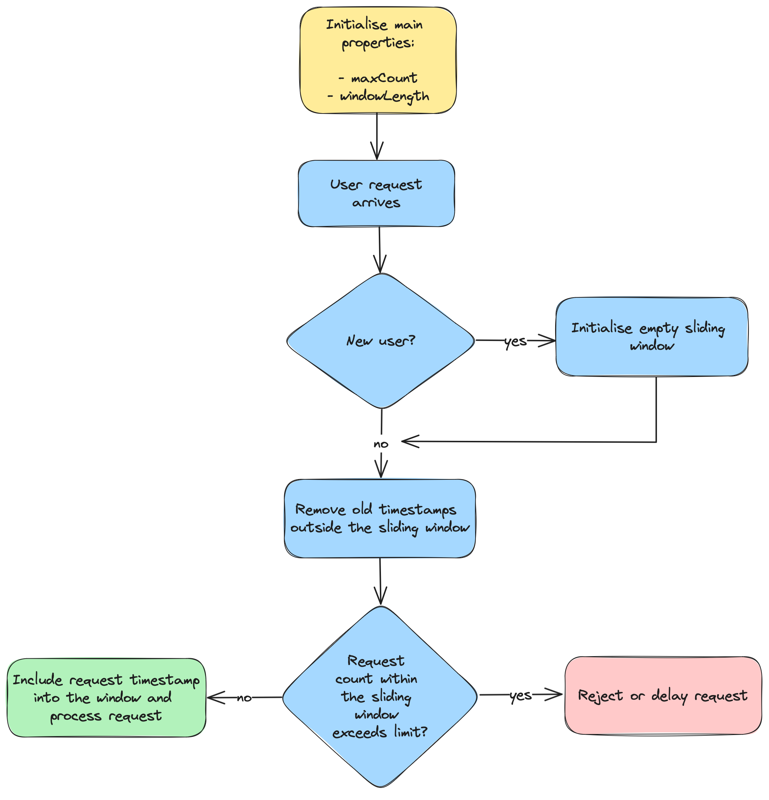

# Rate Limiting

This repository contains Java implementations of various rate limiting algorithms. Its primary purpose is to explore how these algorithms function and the different methods by which they can be implemented.

## Fixed Window Rate Limiting

Basic implementation: [`FixedWindowRateLimiter`](lib/src/main/java/com/rdiachenko/ratelimiting/FixedWindowRateLimiter.java).

The [Fixed Window Rate Limiting](https://www.rdiachenko.com/posts/arch/rate-limiting/fixed-window-algorithm/) algorithm is initialized with two key properties: the maximum number of requests allowed per window and the length of each window. As illustrated in the flow diagram below, a request is successfully processed if the current request count within the ongoing window does not exceed the maximum limit. If the limit is exceeded, the request is either rejected or delayed. A new window is initiated, and the request count is reset, when the request's timestamp falls outside the current window.

## Sliding Window Rate Limiting

Basic implementation: [`SlidingWindowLogRateLimiter`](lib/src/main/java/com/rdiachenko/ratelimiting/SlidingWindowLogRateLimiter.java), [`SlidingWindowCountRateLimiter`](lib/src/main/java/com/rdiachenko/ratelimiting/SlidingWindowCountRateLimiter.java) (memory-optimized).

The [Sliding Window Rate Limiting](https://www.rdiachenko.com/posts/arch/rate-limiting/sliding-window-algorithm/) algorithm is initialized with two key properties: the maximum number of requests allowed per window and the window’s duration. As shown in the flow diagram below, a new sliding window is created once for each new user. This window tracks the timestamps of the user’s requests. Upon the arrival of a new request, any old timestamps outside the sliding window are discarded to accommodate new ones. If the number of requests within the window exceeds the set limit, the incoming request is either rejected or delayed. Otherwise, it is added to the window and processed successfully.

