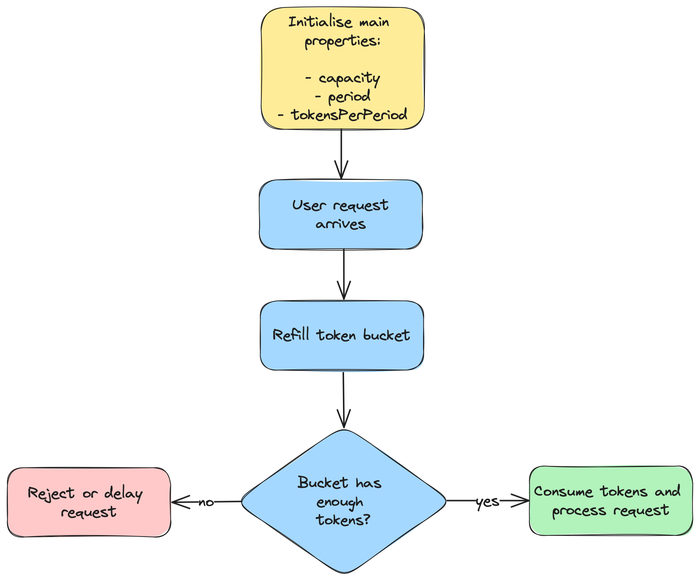
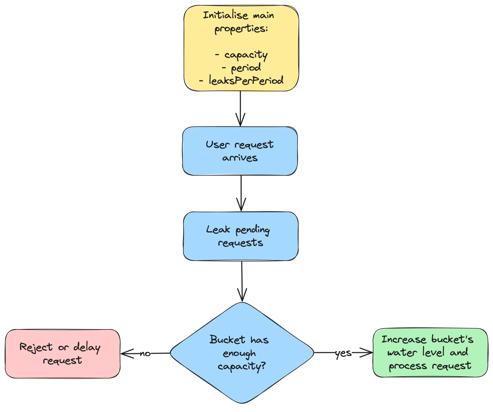

# Rate Limiting

This repository contains Java implementations of various rate limiting algorithms. Its primary purpose is to explore how these algorithms function and the different methods by which they can be implemented.

## Table of Contents
- [Fixed Window Rate Limiting](#fixed-window-rate-limiting)
- [Sliding Window Rate Limiting](#sliding-window-rate-limiting)
- [Token Bucket Rate Limiting](#token-bucket-rate-limiting)
- [Leaky Bucket Rate Limiting](#leaky-bucket-rate-limiting)
- [Adaptive Rate Limiting](#adaptive-rate-limiting)
- [Distributed Rate Limiting](#distributed-rate-limiting)

## Fixed Window Rate Limiting

Implementations:
- Basic: [`FixedWindowRateLimiter`](lib/src/main/java/com/rdiachenko/ratelimiting/FixedWindowRateLimiter.java).
- Thread safe: WIP.

The [Fixed Window Rate Limiting](https://www.rdiachenko.com/posts/arch/rate-limiting/fixed-window-algorithm/) algorithm is initialized with two key properties:
- The maximum number of requests allowed per window.
- The length of each window.

As illustrated in the flow diagram below, a request is successfully processed if the current request count within the ongoing window does not exceed the maximum limit. If the limit is exceeded, the request is either rejected or delayed. A new window is initiated, and the request count is reset, when the request's timestamp falls outside the current window.

## Sliding Window Rate Limiting

Implementations:
- Basic: [`SlidingWindowLogRateLimiter`](lib/src/main/java/com/rdiachenko/ratelimiting/SlidingWindowLogRateLimiter.java).
- Memory-optimized: [`SlidingWindowCountRateLimiter`](lib/src/main/java/com/rdiachenko/ratelimiting/SlidingWindowCountRateLimiter.java).
- Thread safe: WIP.

The [Sliding Window Rate Limiting](https://www.rdiachenko.com/posts/arch/rate-limiting/sliding-window-algorithm/) algorithm is initialized with two key properties:
- The maximum number of requests allowed per window.
- The window’s duration.

As shown in the flow diagram below, a new sliding window is created once for each new user. This window tracks the timestamps of the user’s requests. Upon the arrival of a new request, any old timestamps outside the sliding window are discarded to accommodate new ones. If the number of requests within the window exceeds the set limit, the incoming request is either rejected or delayed. Otherwise, it is added to the window and processed successfully.

## Token Bucket Rate Limiting

Implementations:
- Basic: [`TokenBucketRateLimiter`](lib/src/main/java/com/rdiachenko/ratelimiting/TokenBucketRateLimiter.java).
- Thread safe: WIP.

The [Token Bucket Rate Limiting](https://www.rdiachenko.com/posts/arch/rate-limiting/token-bucket-algorithm/) algorithm is initialized with the following key properties:
- The maximum number of tokens that the bucket can hold.
- The period over which tokens are replenished within the bucket.
- The number of tokens added to the bucket at each period.

As shown in the flow diagram below, an attempt to refill the token bucket is made whenever a request arrives. The number of new tokens added depends on the time elapsed since the last refill. If the bucket contains a sufficient number of tokens, the necessary amount is deducted, and the request is processed successfully, otherwise, it is either rejected or postponed until enough tokens become available.

## Leaky Bucket Rate Limiting

Implementations:
- Basic: [`LeakyBucketRateLimiter`](lib/src/main/java/com/rdiachenko/ratelimiting/LeakyBucketRateLimiter.java).
- Thread safe: WIP.

The [Leaky Bucket Rate Limiting](https://www.rdiachenko.com/posts/arch/rate-limiting/leaky-bucket-algorithm/) algorithm is initialized with the following key properties:
- The maximum number of requests a user can make within a specified period before being limited.
- The time period during which requests are evaluated for limiting.
- The number of requests permitted to leak out (be processed) per period.

As shown in the flow diagram below, each incoming request triggers an attempt to leak the bucket, with the number of leaks varying based on the time elapsed since the last leak. If the bucket has enough capacity for the incoming request, the water level in the bucket rises, and the request is processed successfully. Otherwise, the request is either rejected or delayed until enough leakage occurs to lower the water level sufficiently.

## Adaptive Rate Limiting

WIP

## Distributed Rate Limiting

WIP
